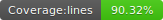

# nodeboot-socket-io-starter

<p float="left">
  
  
  
  
</p>


Library used in [nodeboot-rest-starter](https://github.com/nodeboot/nodeboot-rest-starter) which allows us to work with socket io

## How it works

In your source code , install the starter

```
npm install nodeboot/nodeboot-socket-io-starter#1.0.3-snapshot
```

Then add a simple module  (not typescript)

```js
@SocketIoController
function SumController() {

  @SocketIoEvent(eventName = "input")
  this.input = async (data, currentSocket, globalSocket) => {
    console.log(`socket id: ${currentSocket.id}`)
    console.log("headers on event:")
    console.log(currentSocket.handshake.headers)
    //do whatever you want with the received data
    //also you can emit events using globalSocket.emit
    globalSocket.emit('output', {result: data.number*2});
  }

}

module.exports = SumController;
```

That's all. Connect with some socket client to **http://localhost:2104** and send a json with event id **input**

## Contributors

<table>
  <tbody>
    <td style="text-align: center;" >
      
      <br />
      <label><a href="http://jrichardsz.github.io/">JRichardsz</a></label>
      <br />
    </td>    
  </tbody>
</table>
